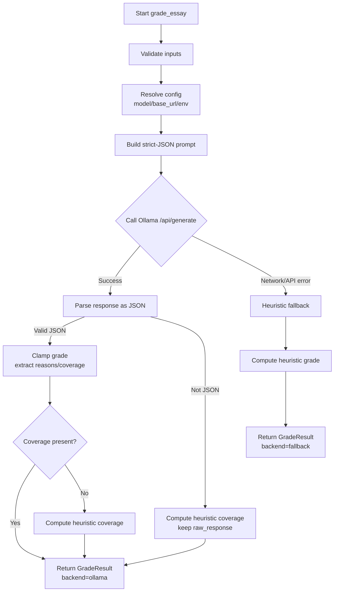

### EssayGrader Workflow

This document explains how the `essaygrader` module evaluates an essay against a list of requirements using a local LLM (via Ollama) with a deterministic heuristic fallback.

#### What it is
- A single function interface: `grade_essay(essay: str, requirements: list[str], *, model=None, base_url=None, temperature=0.2, timeout=30.0) -> dict`
- Local-first: prefers a locally hosted model through Ollama.
- Resilient: if the LLM is unavailable or returns malformed output, it falls back to a transparent heuristic.

#### Inputs and Outputs
- Inputs
  - `essay`: string — the student’s essay text.
  - `requirements`: list of strings — each describes a fact/topic the essay should address.
  - Optional tuning via keyword args: `model`, `base_url`, `temperature`, `timeout`.

- Output (always a dict with a stable shape)
  - `grade`: int in 0–100
  - `reasons`: list[str] — short explanations for the grade or fallback reasons
  - `coverage`: list[object]
    - `requirement`: str
    - `addressed`: bool
    - `evidence`: str (short snippet or note)
  - `backend`: "ollama" | "fallback"
  - `model_used`: str | null
  - `raw_response`: str | null — raw model JSON or raw text if non-JSON

#### Environment configuration
- `ESSAYGRADER_MODEL` (default: `"llama3.1:8b"`)
- `ESSAYGRADER_OLLAMA_BASE_URL` (default: `"http://localhost:11434"`)

You can also override these via function parameters `model` and `base_url`.

---

### High-level Flow



Key design points
- Single network call: one POST to `base_url/api/generate` with `stream=False`.
- Strict JSON request: the prompt instructs the model to output only a JSON object.
- Robust parsing: attempts `json.loads`; if that fails, extracts the first `{...}` block; otherwise falls back.
- Transparent results: `backend` and `raw_response` show what happened.

---

### Step-by-step Details
1. Validation
   - Ensures `essay` is a non-empty string and `requirements` is a list of strings. Otherwise raises `ValueError`.

2. Configuration
   - Picks `model` and `base_url` from parameters or environment variables. Default model: `llama3.1:8b`. Default base URL: `http://localhost:11434`.

3. Prompt construction
   - Builds a concise, rubric-based prompt that demands strict JSON with keys: `grade`, `reasons`, `coverage`, `suggestions`.

4. LLM attempt (preferred path)
   - Calls Ollama `POST /api/generate` with payload `{ model, prompt, stream:false, options:{temperature} }`.
   - Expects response JSON containing a `response` field (text). Attempts to parse that text as JSON.

5. JSON parsing
   - Try `json.loads` directly.
   - If that fails, try to extract the first top-level JSON object via brace matching, then parse.

6. Consolidation
   - If LLM JSON is valid: clamp `grade` to [0,100], read `reasons` and `coverage`.
   - If `coverage` missing/invalid: compute heuristic coverage from the essay and requirements.
   - Return with `backend="ollama"` and `raw_response` set to the parsed JSON string.

7. Non-JSON LLM output
   - Compute heuristic coverage; `grade` derived from coverage ratio.
   - Return with `backend="ollama"` and `raw_response` containing the raw model text for transparency.

8. Failure to call LLM
   - If the HTTP call fails or times out: heuristic fallback path.
   - Returns with `backend="fallback"`, reasons explain the failure, and `raw_response=None`.

---

### Heuristic Coverage and Grading
- Coverage heuristic
  - Tokenizes each requirement into alphanumeric words (>2 chars), counts word-boundary matches in the essay (case-insensitive).
  - A requirement is `addressed` if at least half of its tokens appear, or at least 3 tokens match.
  - Provides a short `evidence` snippet around the first matching token when possible.

- Grade mapping
  - Score = round((addressed_count / total_requirements) * 100), clamped to [0,100].

Limitations
- This heuristic is lexical; it cannot capture deep semantics, paraphrase, or negations. It is intentionally simple for determinism and speed.

---

### Example Usage
```python
from essaygrader import grade_essay

essay = """
Photosynthesis converts light energy into chemical energy. Chlorophyll in chloroplasts absorbs light,
producing glucose and oxygen. Carbon dioxide and water are essential inputs.
"""
requirements = [
    "Explains that photosynthesis converts light energy into chemical energy",
    "Mentions the role of chlorophyll",
    "States that oxygen is produced",
    "Includes the inputs: carbon dioxide and water",
]

result = grade_essay(essay, requirements)
print(result)
```

Example successful result (shape)
```json
{
  "grade": 92,
  "reasons": ["Covers all major points with minor omissions."],
  "coverage": [
    {"requirement": "Explains that photosynthesis converts light energy into chemical energy", "addressed": true, "evidence": "...converts light energy into chemical energy."},
    {"requirement": "Mentions the role of chlorophyll", "addressed": true, "evidence": "...chlorophyll... absorbs light."},
    {"requirement": "States that oxygen is produced", "addressed": true, "evidence": "...producing ... oxygen."},
    {"requirement": "Includes the inputs: carbon dioxide and water", "addressed": true, "evidence": "...Carbon dioxide and water are essential inputs."}
  ],
  "backend": "ollama",
  "model_used": "llama3.1:8b",
  "raw_response": "{...}"
}
```

---

### Error Handling and Timeouts
- Input errors raise `ValueError`.
- Network/parse errors do not propagate; instead, the function returns a fallback result accompanied by explanatory `reasons`.
- `timeout` controls the HTTP request duration (seconds) to the local model server.

---

### Local Model Setup (Ollama)
1. Install Ollama: https://ollama.com
2. Pull a suitable model, for example:
   - `ollama pull llama3.1:8b`
3. Ensure the server is running (default at `http://localhost:11434`).
4. Optionally set environment variables:
   - `export ESSAYGRADER_MODEL="llama3.1:8b"`
   - `export ESSAYGRADER_OLLAMA_BASE_URL="http://localhost:11434"`

---

### Tuning and Tips
- Use `temperature=0.0–0.4` for more stable JSON compliance.
- Keep requirements concise and specific to improve both LLM and heuristic performance.
- If your model frequently outputs non-JSON, consider adjusting the prompt or switching models.

---

### File References
- Implementation: `essaygrader.py`
- Project readme: `README.md`
- This document: `DOCS/ESSAYGRADER_WORKFLOW.md`

---

### Version
- Document generated on 2025-12-03.
